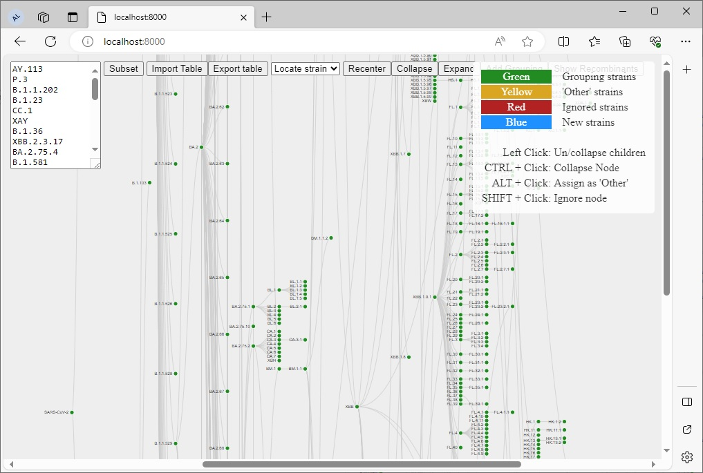

# covid-lineage-table
 <div align="center">
 
 [](https://lifecycle.r-lib.org/articles/stages.html#experimental) [](https://github.com/provlab-bioinfo/covid-lineage-table/issues) [](https://www.gnu.org/licenses/gpl-3.0.en.html) [](https://www.python.org/) [](https://github.com/provlab-bioinfo/covid-lineage-table/blob/main/NEWS) [](https://github.com/provlab-bioinfo/covid-lineage-table/commits/main/)
 
 </div>

## Introduction

Based on [pango-watch](https://github.com/MDU-PHL/pango-watch), this tool visualizes SARS-CoV-2 lineages and creates a reference table for heirarchical grouping of SARS-CoV-2 lineages, based on Pango nomenclature<sup>[1](#references)</sup>. As a single document, synchronizing lineage groupings between different groups/entities becomes much simpler, and can more easily be integrated into different platforms and programming languages.

## Table of Contents

- [Introduction](#introduction)
- [Quick-Start Guide](#quick-start%guide)
- [Usage](#usage)
- [Output](#output)
- [References](#references)

## Quick-Start Guide

### Online

You can access the online lineage tool [here](https://provlab-bioinfo.github.io/covid-lineage-table/):
    
```    
https://provlab-bioinfo.github.io/covid-lineage-table/
```

The reference lineage tree is automatically updated nightly.

### Hosting locally

First, download the repo. Then, generate the up-to-date tree and host the webpage:
```powershell
cd <path/to/covid-lineage-table/>
python generateTree.py
python -m http.server
```

Access via your browser:
```
http://localhost:8000/
```



## Usage

Each SARS-CoV-2 strain is represented as a node, with branches leading to its parent and child strains. The color of the node determines how it is going to be grouping in the reference table. The table can be exported to a .csv file, or can be imported to quickly restore the tree structure. An overview of node appearance and user actions:

| Node&nbsp;appearance          |                                                                                                                                                                                                                                                                                                                                                                                                  |
|----------------|--------------------------------------------------------------------------------------------------------------------------------------------------------------------------------------------------------------------------------------------------------------------------------------------------------------------------------------------------------------------------------------------------|
| Green          | These identify the desired strains to group into. E.g., if **XBB.1** is a Grouping strain, then all children (**XBB.1.***) will be combined into this group. In the reference table export, the column **grouping** will exclusively contain the green nodes.                                                                                                                                                       |
| Red            | These identify strains that be **Ignored**, meaning that it will not have a distinct grouping. Instead, the tree will be traversed upwards until a green (**Grouping**) strain is found. All strains with a red node will be grouped into parent strain that has a green node.                                                                                                                           |
| Yellow         | These identify **Other** strains. Instead of grouping into a parent strain, all strains with a yellow node will be grouped together into the **Other** grouping. If the strain is recombinant (with a variant name of **X****, such as **XBB**), or the child of a recombinant, it will instead be grouped into **Recombinant Other**.                                                                                            |
| Blue           | These identify **New** strains that have been added to the pango-DB since the last reference table was generated. These are only seen if **Import Table** was used. If blue strains are exported, they will become either yellow, if the strain is a novel recombinant strain (**Recombinant Other**; e.g., **XDR**), or red (**Ignored**) otherwise, and will appear as such if the reference table is re-imported. |
| Node&nbsp;Outline        | Nodes are outlined in black if it contains collapsed child strains.<br>Nodes are outlined in white if there are no collapsed child strains.                                                                                                                                                                                                                                                                                                                              |


| Mouse&nbsp;actions          |                                                                                                                                                                                                                                                                                                                                                                                                  |
|----------------|--------------------------------------------------------------------------------------------------------------------------------------------------------------------------------------------------------------------------------------------------------------------------------------------------------------------------------------------------------------------------------------------------|
| Left Click     | This collapses or uncollapses the children of a strain. Strains that are collapsed will be considered **Ignored**. If a child strain is clicked, it instead will collapse itself into its strain.                                                                                                                                                                                                    |
| CTRL&nbsp;+&nbsp;Click   | The collapses or uncollapses a single strain (plus its child strains) into its parent strain.                                                                                                                                                                                                                                                                                                    |
| ALT&nbsp;+&nbsp;Click    | This assigns a strain as **Other**. This node will become yellow.                                                                                                                                                                                                                                                                                                                                    |
| SHIFT&nbsp;+&nbsp;Click  | This assigns a strain as **Ignored**. This node will become red.                                                                                                                                                                                                                                                                                                                                     |

| UI Buttons     |                                                                                                                                                                                                                                                                                                                                                                                                  |
|----------------|--------------------------------------------------------------------------------------------------------------------------------------------------------------------------------------------------------------------------------------------------------------------------------------------------------------------------------------------------------------------------------------------------|
| Subset         | This will collapse the lineage tree into only the strains present in the box to the left. Must have only one strain per line. Only strains that exist can be included, and all others will be ignored.                                                                                                                                                                                           |
| Import&nbsp;Table   | This will re-create a previous lineage tree based on a lineage reference table that was previously exported with **Export Table**.                                                                                                                                                                                                                                                                   |
| Export&nbsp;Table   | This generates a SARS-CoV-2 lineage grouping reference table. The .csv file contains the following columns:<br>&nbsp;&nbsp;&nbsp;**name**: the full name of the SARS-CoV-2 reference strain.<br>&nbsp;&nbsp;&nbsp;**alias**: the variant name of the strain, as per PANGO.<br>&nbsp;&nbsp;&nbsp;**clade**: the NextClade<sup>[2](#references)</sup> grouping of the strain<br>&nbsp;&nbsp;&nbsp;**grouping**: the name of the parent grouping strain<br>&nbsp;&nbsp;&nbsp;**label**: the grouping label, either the parent **Grouping** strain, **Other**, or **Recombinant Other**.<br>&nbsp;&nbsp;&nbsp;**designationDate**: the date the strain was designated, as per NextClade, in **MM/DD/YYYY** format |
| Locate&nbsp;Strain  | This will expand the lineage tree to expose the selected strain                                                                                                                                                                                                                                                                                                                                  |
| Recenter       | This recenters the tree on the root node, just in case the tree is lost off-screen somewhere.                                                                                                                                                                                                                                                                                                    |
| Collapse       | This collapses all nodes down to the origin SARS-CoV-2 strain.                                                                                                                                                                                                                                                                                                                                   |
| Expand         | This expands all uncollapsed nodes.                                                                                                                                                                                                                                                                                                                                                              |
| Add&nbsp;Grouping   | This adds the current **Grouping** of the node to the hover tooltip, as the groupings are not calculated in real-time for performance reasons.                                                                                                                                                                                                                                                       |
| Subset&nbsp;Mermaid | Deletes all nodes that are not green (**Grouping**) or a parent of a green node. This is used before **Export Mermaid**. The tree will be irreparably altered, and the page must be reloaded to use as normal.                                                                                                                                                                                           |
| Export&nbsp;Mermaid | This exports a text file that contains the lineage tree in a format that is readable by **Mermaid.js**<sup>[3](#references)</sup>.           

## Output

An exported table has the format of:
```
name             [SARS-CoV-2 strain identifier]
alias            [Pangolin alias]
clade            [NextClade designation]
grouping         [The parent strain grouping]
label            [Indicates 'Other' strains]
designationDate  [Date of strain designation]
```

## References

1. O’Toole, Áine, et al. "Assignment of epidemiological lineages in an emerging pandemic using the pangolin tool." Virus evolution 7.2 (2021): veab064.

2. Aksamentov, Ivan, et al. "Nextclade: clade assignment, mutation calling and quality control for viral genomes." Journal of open source software 6.67 (2021): 3773.

3. Sveidqvist, Knut, et al. "Mermaid: Generate diagrams from markdown-like text." https://mermaid.js.org/  